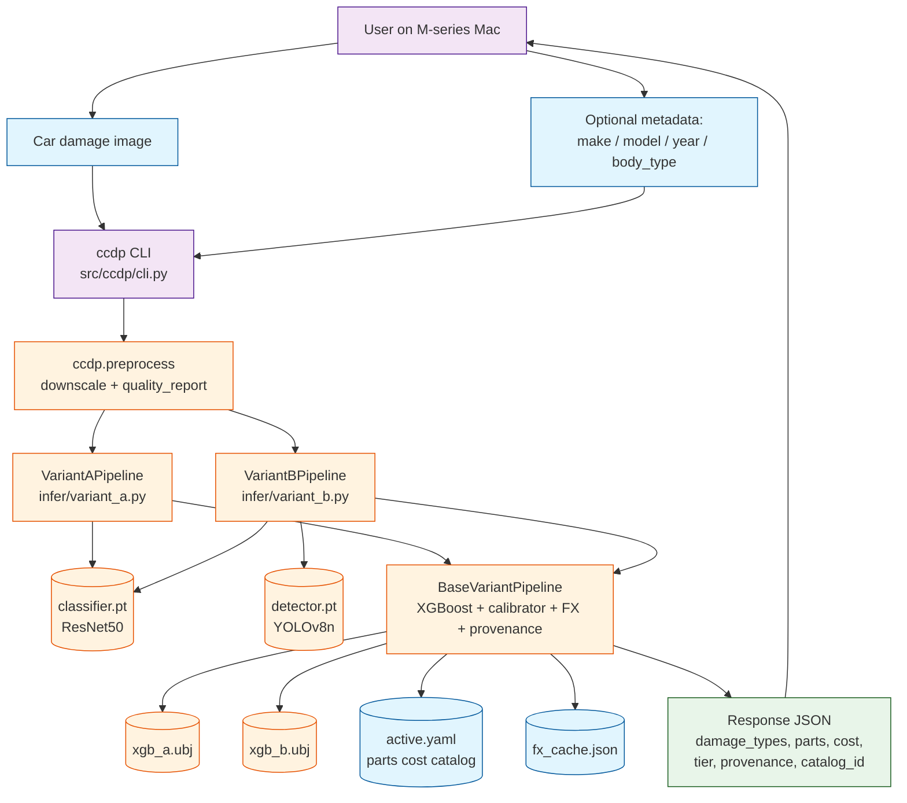
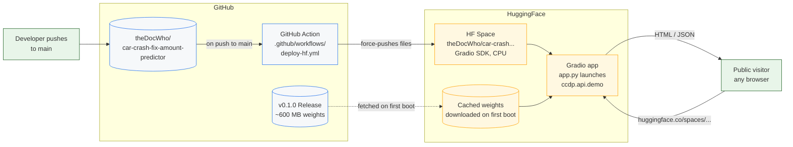
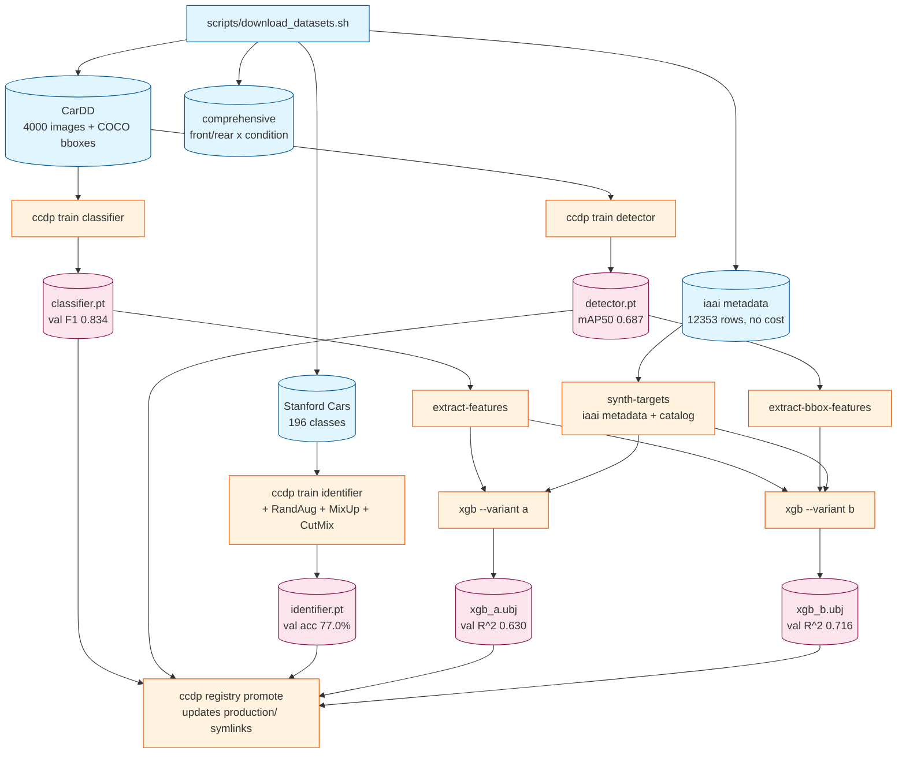

# Car Crash Fix Amount Predictor (`ccdp`)

End-to-end capstone project that identifies damaged parts from car photos and estimates repair cost. Two damage-recognition variants are trained, compared, and routed through a calibrated cost pipeline:

- **Variant A** — ResNet50 multi-label classifier over the 6 CarDD damage types (no localization).
- **Variant B** — YOLOv8 detector + bounding-box-aware XGBoost regressor (with part localization).

Cost output is calibrated against a **versioned, swappable parts-cost catalog** so prices stay current without retraining the model.

See [PLAN.md](PLAN.md) for the full design and [progress/STATUS.md](progress/STATUS.md) for what's built.

---

## Current production metrics

| Model | Variant | Best metric | Run dir |
|---|---|---|---|
| Stanford Cars identifier (ResNet50 + RandAugment + MixUp + CutMix) | — | **val acc 77.0%** | `run_2026-05-13T14-30-04_identifier_v2` |
| CarDD damage classifier (ResNet50, 6 damage types) | A | **val macro-F1 0.834** | `run_2026-05-12T20-59-41_classifier_v1` |
| CarDD damage detector (YOLOv8n) | B | **mAP50 0.687 / mAP50-95 0.540** | `run_2026-05-13T05-18-40_yolov8n_v2` |
| XGBoost(A) — image features + tabular → cost | A | **val R² 0.630, test R² 0.642, MAPE 32.9%** | `run_2026-05-13T04-34-33_xgb_a_v1` |
| XGBoost(B) — A's features + bbox stats → cost | B | **val R² 0.716, test R² 0.736, MAPE 24.4%** | `run_2026-05-13T11-16-25_xgb_b_v2` |

Variant B beats Variant A by **+9 pts of R²** and **−8 pts of MAPE** — quantifying exactly how much the detection-derived bbox features improve cost regression.

Trained weights for all five models are attached to the [v0.1.0 release](https://github.com/theDocWho/car-crash-fix-amount-predictor/releases/tag/v0.1.0).

---

## Quickstart

```bash
# 1. Set up env (Python 3.10+)
python -m venv .venv
source .venv/bin/activate
pip install -e ".[ml,serve,dev]"

# 2. (macOS only) certifi + libomp shims
export SSL_CERT_FILE=$(python -c "import certifi; print(certifi.where())")
export DYLD_LIBRARY_PATH=$(python -c "import torch, os; print(os.path.join(os.path.dirname(torch.__file__),'lib'))")

# 3. Initialize the cost catalog
ccdp costing init

# 4. (Optional) Fetch live USD→INR rate
ccdp fx refresh

# 5. Either download datasets + train from scratch (~4 hrs), OR
#    grab the trained weights from the v0.1.0 release.
```

### Train from scratch

```bash
# Datasets (requires ~/.kaggle/access_token; ~10 GB total)
bash scripts/download_datasets.sh

# Train (sequential on a single MPS device; expect ~4 hrs total)
ccdp train identifier   --epochs-stage1 3 --epochs-stage2 12 --batch-size 32 --num-workers 4
ccdp train classifier   --epochs-stage1 3 --epochs-stage2 12 --batch-size 32 --num-workers 4
ccdp train detector     --epochs 50 --batch 16 --imgsz 640 --workers 4 --tag yolov8n_v1

# Promote (or use whichever run beats current production)
ccdp registry promote <id_run> identifier
ccdp registry promote <cls_run> classifier
ccdp registry promote <det_run> detector

# Build downstream features + train both XGBoost variants
ccdp train extract-features
ccdp train synth-targets
ccdp train extract-bbox-features
ccdp train xgb --variant a --n-estimators 600 --max-depth 7 --tag xgb_a_v1
ccdp train xgb --variant b --n-estimators 600 --max-depth 7 --tag xgb_b_v1
ccdp registry promote <xgb_a_run> xgb_a
ccdp registry promote <xgb_b_run> xgb_b
```

### Use pretrained weights (from the GitHub release)

Download the release assets into `checkpoints/production/`:

```bash
mkdir -p checkpoints/production
gh release download v0.1.0 -R theDocWho/car-crash-fix-amount-predictor -D checkpoints/production
```

### Inference

```bash
# Variant A (classifier-only)
ccdp infer path/to/car.jpg --model resnet \
    --make toyota --model-name camry --year 2019 --body-type sedan --currency USD

# Variant B (detector + bbox features)
ccdp infer path/to/car.jpg --model yolov8 \
    --make toyota --model-name camry --year 2019 --body-type sedan --currency INR

# Both side-by-side
ccdp infer path/to/car.jpg --model both --currency USD
```

Every prediction returns `damage_types`, `parts`, `cost_usd`, `tier`, `provenance`, `catalog_id`, and `fx_snapshot` — fully audited.

---

## Project structure

```
car-crash-fix-amount-predictor/
├── PLAN.md                 — Full design document, all 4 phases
├── CITATIONS.md            — Dataset attributions and licenses
├── CONTRIBUTING.md         — Branch workflow + code style
├── pyproject.toml          — Package metadata + dependency groups
├── data/
│   ├── raw/                — gitignored; populated by scripts/download_datasets.sh
│   ├── processed/          — gitignored; feature parquets, reference table
│   └── parts_cost_catalog/ — tracked YAMLs + active.yaml symlink
├── notebooks/
│   └── 01_eda.ipynb        — Dataset reconciliation, label distributions, samples
├── scripts/
│   ├── download_datasets.sh   — Kaggle CLI pull of all training corpora
│   ├── train_all.sh           — Full training sequence (~4 hrs)
│   └── extend_*.sh            — Resume / fine-tune helpers
├── checkpoints/            — gitignored; trained weights + registry.json + production/ symlinks
├── tests/                  — 64 pytest tests, all green
├── progress/               — One file per phase with status, metrics, decisions
└── src/ccdp/
    ├── cli.py                       — Typer CLI; entrypoint `ccdp …`
    ├── utils/
    │   ├── device.py                — pick_device(), seed_everything()
    │   └── transforms.py            — IMAGENET stats, train/eval transforms (with RandAugment)
    ├── data/
    │   ├── schema.py                — Record / BBox dataclasses, DAMAGE_TYPES, infer_part_from_damage()
    │   ├── loaders.py               — iter_cardd / iter_comprehensive / iter_iaai generators
    │   ├── stanford_cars.py         — .mat parser, 90/10 stratified split, torchvision Dataset
    │   ├── damage_dataset.py        — CarDD multi-label encoding + pos_weight + Dataset
    │   └── cardd_yolo.py            — COCO -> Ultralytics YOLO directory converter
    ├── identification/
    │   ├── car_identifier.py        — Filename / EXIF / OCR / color heuristics; IdentificationResult
    │   ├── reference_table.py       — (make,model,year,body)→cost table, nearest() lookup
    │   ├── build_reference.py       — Build reference table from iaai metadata
    │   ├── unidentified.py          — SQLite bucket with auto-naming + relabelling API
    │   └── fallback_estimator.py    — Three-tier estimator (exact / nearest_class / category_only)
    ├── costing/
    │   ├── catalog.py               — Versioned YAML catalogs, save / load / activate / diff
    │   ├── fx.py                    — USD↔INR fetch with cache + manual override
    │   └── calibrator.py            — Scale prediction by active_median / training_median
    ├── models/
    │   ├── identifier.py            — ResNet50 head (196 classes) + two-stage finetune toggle
    │   ├── damage_classifier.py     — ResNet50 head (6 damage types) + feature extractor
    │   └── xgb_regressor.py         — XGBRegressorBundle (schema + training catalog id)
    ├── train/
    │   ├── train_car_identifier.py     — Identifier trainer (RandAugment + MixUp + CutMix)
    │   ├── train_damage_classifier.py  — Classifier trainer (BCE + pos_weight)
    │   ├── train_yolov8.py             — Detector trainer (Ultralytics wrapper)
    │   ├── train_xgb.py                — XGBoost(A|B) trainer + metric reporting
    │   ├── mixup.py                    — Batch-level MixUp / CutMix + soft_cross_entropy
    │   ├── extract_features.py         — Classifier backbone → 2048-d image features
    │   ├── extract_bbox_features.py    — Detector bboxes → per-image bbox stats
    │   └── synthesize_cost.py          — Sample metadata + compute catalog-driven cost target
    ├── registry/
    │   └── registry.py              — create_run / save_checkpoint / promote / list_entries
    └── infer/
        ├── base.py                  — BaseVariantPipeline: XGBoost loading + FX + provenance
        ├── variant_a.py             — VariantAPipeline (classifier-only, no localization)
        └── variant_b.py             — VariantBPipeline (detector + bbox-aware XGBoost)
```

Phase status: see [progress/STATUS.md](progress/STATUS.md). Full design rationale: [PLAN.md](PLAN.md).

---

## Diagrams

### Local execution (single image)



### Deployment (GitHub → HuggingFace Space)



### Training (Phases 1–2; already complete in v0.1.0)



---

## Execution flow

### Training (run once, then promote the winning runs)

```
download_datasets.sh  ─►  data/raw/{cardd, stanford_cars, iaai, comprehensive}
                              │
              ┌───────────────┼────────────────────────────────────────┐
              ▼               ▼                                        ▼
    ccdp train classifier   ccdp train detector              ccdp train identifier
    (ResNet50 6-class       (YOLOv8n on CarDD COCO          (ResNet50 on Stanford
     multi-label,            -> YOLO bboxes,                 Cars, RandAugment +
     BCE + pos_weight)       50 epochs)                      MixUp + CutMix)
              │                       │                              │
              ▼                       ▼                              ▼
    classifier.pt          detector.pt                      identifier.pt
              │                       │                              │
              │                ccdp train extract-bbox-features      │
              ccdp train extract-features                            │
              ccdp train synth-targets                               │
                            │                                        │
                  ┌─────────┴──────────┐                              │
                  ▼                    ▼                              │
    ccdp train xgb         ccdp train xgb                             │
       --variant a            --variant b                             │
                  │                    │                              │
                  ▼                    ▼                              │
              xgb_a.ubj            xgb_b.ubj                          │
                  │                    │                              │
                  └────────────────────┴──── ccdp registry promote ───┘
                                                       │
                                                       ▼
                                         checkpoints/production/*.pt
                                         (symlinks consumed by inference)
```

Total wall-clock target on M-series 16GB: **~4 hours** unattended via
`scripts/train_all.sh`. See [progress/STATUS.md](progress/STATUS.md) for the
exact achieved metrics per phase.

### Inference (single image)

```
image + optional (make, model, year, body_type)
      │
      ▼
ccdp infer  ─►  one of:
    --model resnet  ──►  VariantAPipeline
    --model yolov8  ──►  VariantBPipeline
    --model both    ──►  runs both, returns both

Each Variant pipeline:

  image ──► classifier (Variant A & B both call it for the 2048-d backbone features)
       │
       │      Variant B also: image ──► YOLOv8 detector ──► bboxes ──► bbox_stats
       │                                              └──► parts via infer_part_from_damage(damage_type, bbox_center, body_type)
       │
       ▼
  feature row (image features [+ bbox stats for B] + tabular metadata one-hot)
       │
       ▼
  XGBoost(A|B) ──► raw cost prediction
       │
       ▼
  Calibrator: cost × (active_catalog.median / training_catalog.median)
       │
       ▼
  FX module: convert USD → requested currency
       │
       ▼
  PredictionA / PredictionB with full provenance:
     damage_types, parts, cost, currency, tier, provenance,
     catalog_id, fx_snapshot, bundle_run_id (+ detections for B)
```

If no identification metadata or no XGBoost bundle is available, the pipeline
falls through to the three-tier **catalog-only** fallback estimator
(`identification/fallback_estimator.py`) which produces a tier-3
"category-only" estimate. This is the system's honest behaviour for cars whose
make/model can't be identified — see [PLAN.md §6](PLAN.md).

### Catalog updates without retraining

```
new prices arrive          (e.g. mid-quarter body-shop price refresh)
      │
      ▼
ccdp costing import --file new_prices.csv --tag q2-update
      │
      ▼
new catalog YAML lands in data/parts_cost_catalog/
      │
      ▼
ccdp costing activate <new_catalog_id>
      │
      ▼
next ccdp infer call: Calibrator scales XGBoost output to the new catalog.
NO MODEL RETRAINING NEEDED.
```

The XGBoost bundle records its training-time catalog id; the Calibrator does
the math at inference. This is why the catalog is versioned and the bundle
carries `training_catalog_id` and `training_median`.

---

## Honest disclosures

Documented in detail in [PLAN.md §3](PLAN.md) and the phase docs under [progress/](progress/). Headline items:

1. **No real per-image repair cost data exists publicly.** The IAAI free sample paywalls its cost columns; the ganeshsura Kaggle dataset's cost column is combinatorially synthetic with a broken CSV-to-image join. We chose to make this explicit rather than hide it.
2. **Cost target is synthetic** — derived from `Catalog.estimate(parts × severity × segment)` plus age and ±10% Gaussian noise per row. The trained XGBoost learns this rule, and the **calibrator** scales predictions to whatever catalog is active at inference time so you can update prices without retraining.
3. **Parts-level damage labels are not in any public dataset.** Trainable labels are damage *type* (CarDD: dent/scratch/crack/glass_shatter/lamp_broken/tire_flat) and damage *location* (comprehensive: front/rear × normal/crushed/breakage). Parts are inferred at inference time from `(damage_type, bbox_center, body_type)` via `infer_part_from_damage()`.
4. **Cost predictions are not insurable quotes** — they're calibrated estimates with full provenance, intended for triage / first-line estimation.

When real cost data becomes available (e.g., a research-access slice from Rebrowser's IAAI dataset, or an authoritative body-shop pricing table), swap the catalog via `ccdp costing import` and existing models continue to work via the calibrator.

---

## Contributing

This is a capstone but contributions are welcome — read [CONTRIBUTING.md](CONTRIBUTING.md) before opening a PR. Short version: no commits to `main`; every change goes on a `checkpoint-<N>-<short-desc>` branch and merges only after review.

## License

MIT — see [LICENSE](LICENSE).

## Citations

All datasets and key dependencies are cited in [CITATIONS.md](CITATIONS.md). If you use this project academically, please cite it as:

> Roy, A. (2026). *Car Crash Fix Amount Predictor* [Software]. GitHub. https://github.com/theDocWho/car-crash-fix-amount-predictor
